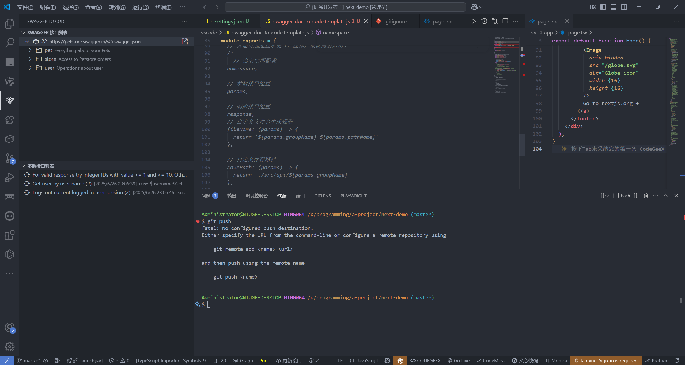

# Swagger Doc To Code

🚀 一个强大的 VS Code 扩展，支持将多种 API 文档格式自动转换为 TypeScript 类型定义和请求代码，提供完整的开发工作流支持。

[](https://marketplace.visualstudio.com/items?itemName=niuge666.swagger-doc-to-code)
[](https://marketplace.visualstudio.com/items?itemName=niuge666.swagger-doc-to-code)
[](https://marketplace.visualstudio.com/items?itemName=niuge666.swagger-doc-to-code)
[](https://github.com/xiaoniuge36/swagger-doc-to-code/blob/main/LICENSE)

## ✨ 特性

### 🎯 核心功能
- 🚀 **多格式支持**: 支持 Swagger v2、OpenAPI 3.0+、Postman Collection 等主流 API 文档格式
- 📝 **智能类型生成**: 自动生成完整的 TypeScript 接口定义，包含请求参数和响应类型
- 🎯 **命名空间隔离**: 每个接口生成独立的命名空间，避免类型冲突
- 🔄 **增量更新**: 智能比对变更，仅更新有变化的接口文件
- 🎨 **自定义模板**: 支持自定义代码生成模板，满足不同项目需求
- ⚡ **快速搜索**: 内置接口搜索功能，快速定位目标 API
- 📋 **一键复制**: 支持生成并复制完整的请求函数代码
- 🌐 **多数据源**: 支持本地文件、远程 URL、多个项目同时管理
- 📁 **智能分组**: 支持按配置源和接口分组自动保存，保持目录结构一致性

### 🚀 增强功能
- 🎉 **智能欢迎**: 首次使用引导和版本升级通知
- 📊 **实时统计**: 状态栏显示 API 数量和快速操作入口
- 🔍 **智能提示**: TypeScript 文件中的 API 类型智能补全
- 🏷️ **悬停信息**: 鼠标悬停显示 API 类型详细信息
- 🔧 **代码镜头**: 在类型定义上方显示快速操作按钮
- 📝 **代码片段**: 内置丰富的 API 请求函数代码片段
- 🧪 **API 测试**: 一键生成测试代码和 cURL 命令
- 📁 **文件监听**: 自动监听 API 文件变化并更新统计
- 📋 **批量操作**: 支持按分组批量复制接口请求代码
- ⚡ **一键模板**: 支持一键创建和管理模板配置文件

## 📸 预览



## 🚀 快速开始

### 1. 安装扩展

在 VS Code 扩展市场搜索 "API Doc to TypeScript" 并安装。

### 2. 配置数据源

在 VS Code 设置中配置你的 API 文档源：

```json
{
  "apiDocToTypes.dataSources": [
    {
      "title": "用户服务 API",
      "url": "https://api.example.com/swagger.json",
      "type": "swagger",
      "link": "https://api.example.com/docs"
    },
    {
      "title": "订单服务 API",
      "url": "./docs/order-api.json",
      "type": "openapi",
      "basePath": "/api/v1"
    }
  ]
}
```

### 3. 生成类型文件

- 使用快捷键 `Alt + Shift + F` 打开接口列表
- 选择需要的接口并生成 TypeScript 类型文件
- 生成的文件将保存到配置的目录中
- 🎉 **首次添加接口文档时，扩展会自动生成模板文件** `.vscode/swagger-doc-to-code.template.js`，用于自定义代码生成格式

### 4. 批量操作和模板管理

#### 📋 批量复制接口请求
- 在本地接口视图中，右键点击任意接口文件
- 选择 "批量复制请求代码" 可一次性复制该分组下所有接口的请求代码
- 复制的代码会自动合并到剪贴板，方便批量导入到项目中

#### ⚡ 一键创建模板配置
- 点击本地接口视图标题栏的 "一键添加模板配置" 按钮
- 或者在接口导入时选择 "创建模板文件" 选项
- 系统会自动创建 `.vscode/swagger-doc-to-code.template.js` 模板文件
- 如果文件已存在，会提示是否覆盖现有配置

## ⚙️ 配置选项

| 配置项 | 说明 | 类型 | 默认值 |
| --- | --- | --- | --- |
| `apiDocToTypes.dataSources` | API 文档数据源列表 | [DataSourceItem](#datasourceitem)[] | [] |
| `apiDocToTypes.savePath` | TypeScript 文件保存路径 | string | 'types/api-interfaces' |
| `apiDocToTypes.showStatusbarItem` | 显示状态栏快捷按钮 | boolean | true |
| `apiDocToTypes.compareChanges` | 启用增量更新（仅更新有变化的文件） | boolean | true |
| `apiDocToTypes.reloadWhenSettingsChanged` | 设置变更时自动重新加载 | boolean | true |
| `apiDocToTypes.generateRequestCode` | 自动生成请求函数代码 | boolean | false |
| `apiDocToTypes.typePrefix` | 类型名称前缀 | string | '' |
| `apiDocToTypes.excludePaths` | 排除的接口路径（支持正则） | string[] | [] |

### DataSourceItem

| 属性 | 说明 | 类型 | 必填 | 示例 |
| --- | --- | --- | --- | --- |
| title | 数据源标题 | string | ✓ | "用户服务 API" |
| url | 文档 URL 或本地路径 | string | ✓ | "https://api.example.com/swagger.json" |
| type | 文档类型 | 'swagger' \| 'openapi' \| 'postman' | ✓ | "swagger" |
| link | 在线文档链接 | string |  | "https://api.example.com/docs" |
| basePath | API 基础路径 | string |  | "/api/v1" |
| headers | 请求头配置 | Record<string, string> |  | {"Authorization": "Bearer token"} |
| timeout | 请求超时时间（毫秒） | number |  | 10000 |

## 🎯 支持的文档格式

### Swagger / OpenAPI
- ✅ Swagger 2.0
- ✅ OpenAPI 3.0.x
- ✅ OpenAPI 3.1.x
- ✅ 支持 JSON 和 YAML 格式
- ✅ 支持复杂的数据类型和嵌套对象
- ✅ 支持枚举类型和联合类型

### Postman Collection
- ✅ Postman Collection v2.1
- ✅ 自动解析请求参数和响应示例
- ✅ 支持环境变量替换

### 其他格式
- 🔄 GraphQL Schema（开发中）
- 🔄 RAML（计划中）
- 🔄 API Blueprint（计划中）

## 🎨 自定义模板

### 自动生成模板文件

🎉 **新功能**: 支持多种方式创建模板配置文件：

#### 方式一：一键创建（推荐）
- 点击本地接口视图标题栏的 "一键添加模板配置" 按钮
- 系统会立即在 `.vscode` 目录下创建 `swagger-doc-to-code.template.js` 模板文件
- 如果文件已存在，会提示是否覆盖

#### 方式二：自动生成
- 当您首次添加接口文档时，扩展会自动生成模板文件
- 在接口导入过程中，如果模板不存在会提示创建

模板文件包含以下预设功能：
- ✅ 自定义命名空间名称
- ✅ 自定义参数和响应接口格式
- ✅ 批量复制请求函数支持
- ✅ 复制请求函数模板
- ✅ 完整的 JSDoc 注释和使用示例

### 基础模板配置

生成的 `.vscode/swagger-doc-to-code.template.js` 文件用于自定义生成的代码格式：

```js
/**
 * 自定义命名空间名称
 * @param {Object} context - 上下文信息
 * @returns {string} 命名空间名称
 */
function namespace(context) {
  const { groupName, pathName, method } = context
  return `${groupName.replace(/[\-\n\s\/\\]/g, '_')}_${pathName}_${method}`
}

/**
 * 自定义参数接口
 * @param {Object} context - 接口上下文
 * @returns {string} 参数接口代码
 */
function params(context) {
  return `export interface Params {
${context.properties.map(prop => `  ${prop.name}${prop.required ? '' : '?'}: ${prop.type}`).join('\n')}
}`
}

/**
 * 自定义响应接口
 * @param {Object} context - 接口上下文
 * @returns {string} 响应接口代码
 */
function response(context) {
  return `export interface Response {
${context.properties.map(prop => `  ${prop.name}${prop.required ? '' : '?'}: ${prop.type}`).join('\n')}
}`
}

module.exports = {
  namespace,
  params,
  response
}
```

### 高级模板示例

模板文件自动生成后，您可以根据需要进行自定义修改：

#### 1. 添加分组前缀

修改 `.vscode/swagger-doc-to-code.template.js` 文件：

```js
function namespace(params) {
  return `${params.groupName.replace(/[\-\n\s\/\\]/g, '_')}_${params.pathName}`
}

module.exports = { namespace }
```

#### 2. 将字段名转化为大驼峰

修改 `.vscode/swagger-doc-to-code.template.js` 文件：

```js
/**
 * 首字母大写
 * @param {String} str
 */
function toUp(str) {
  if (typeof str !== 'string') return ''
  return str.slice(0, 1).toUpperCase() + str.slice(1)
}

function paramsItem(item, params) {
  // 项目标题(SwaggerDocToCode.swaggerJsonUrl[number].title) 为 demo-1 时忽略定制方案
  if (params.groupName === 'demo-1') return

  return `${toUp(item.name)}${item.required ? ':' : '?:'} ${item.type}`
}

module.exports = { paramsItem }
```

#### 3. 复制请求函数

模板文件已预设了复制请求函数功能。您可以根据需要修改 `.vscode/swagger-doc-to-code.template.js` 文件中的 `copyRequest` 函数：

如果导出了 `copyRequest` 函数，即可使用此功能。相关按钮将出现在这几个位置：
- 本地接口列表操作按钮
- `.d.ts` 文件标题栏操作按钮
- `.d.ts` 文件代码行首文字按钮

下面是一个例子：

```js
/**
 * 请求函数模板
 *
 * @param {{
 *  fileName: string
 *  ext: string
 *  filePath: string
 *  name?: string
 *  namespace?: string
 *  path?: string
 *  method?: string
 *  update?: string
 *  ignore?: boolean
 *  savePath?: string
 * }} fileInfo
 * @returns
 */
function copyRequest(fileInfo) {
  return [
    `/** ${fileInfo.name} */`,
    `export async function unnamed(params?: ${fileInfo.namespace}.Params, options?: RequestOptions) {`,
    `  return $api`,
    `    .request<${fileInfo.namespace}.Response>('${fileInfo.path}', params, {`,
    `      method: ${fileInfo.method},`,
    `      ...options,`,
    `    })`,
    `    .then((res) => res.content || {})`
    `}`,
  ]
}

module.exports = {
  // ...
  copyRequest,
}
```

#### 4. 添加 JSDoc 注释

```js
function namespace(context) {
  return [
    `/**`,
    ` * ${context.summary || context.pathName}`,
    ` * @description ${context.description || ''}`,
    ` * @method ${context.method.toUpperCase()}`,
    ` * @path ${context.path}`,
    ` */`,
    `export namespace ${context.pathName} {`
  ].join('\n')
}
```

#### 5. 生成请求函数

```js
function requestFunction(context) {
  const { namespace, path, method, summary } = context
  
  return [
    `/**`,
    ` * ${summary}`,
    ` */`,
    `export async function ${namespace.toLowerCase()}(`,
    `  params?: ${namespace}.Params,`,
    `  options?: RequestOptions`,
    `) {`,
    `  return request<${namespace}.Response>({`,
    `    url: '${path}',`,
    `    method: '${method.toUpperCase()}',`,
    `    ${method.toLowerCase() === 'get' ? 'params' : 'data'}: params,`,
    `    ...options`,
    `  })`,
    `}`
  ].join('\n')
}
```

#### 6. 类型转换优化

```js
function typeMapping(swaggerType, format) {
  const typeMap = {
    'integer': 'number',
    'number': 'number',
    'string': format === 'date-time' ? 'Date' : 'string',
    'boolean': 'boolean',
    'array': 'Array',
    'object': 'Record<string, any>'
  }
  
  return typeMap[swaggerType] || 'any'
}
```

## 🔧 高级功能

### 忽略特定接口

在生成的 `.d.ts` 文件头部添加 `@ignore` 标记，可在批量更新时跳过该文件：

```typescript
/**
 * @name 用户登录接口
 * @path /api/auth/login
 * @method POST
 * @update 2024/01/15 10:30:00
 * @ignore
 */
export namespace UserLogin {
  // ...
}
```

### 批量操作

- **批量生成**: 选择多个接口一次性生成所有类型文件
- **批量更新**: 检查所有已生成的文件并更新有变化的接口
- **批量删除**: 清理不再存在的接口对应的类型文件

### 代码片段集成

扩展提供了丰富的代码片段，在 TypeScript 文件中输入以下前缀：

- `api-get`: 生成 GET 请求函数
- `api-post`: 生成 POST 请求函数
- `api-put`: 生成 PUT 请求函数
- `api-delete`: 生成 DELETE 请求函数
- `api-interface`: 生成接口类型定义

## 🎮 快捷键

| 快捷键 | 功能 | 说明 |
| --- | --- | --- |
| `Alt + Shift + F` | 打开接口搜索面板 | 快速搜索和导入 API 接口 |
| `Alt + Shift + G` | 生成当前文件对应的请求函数 | 基于当前类型文件生成请求代码 |
| `Alt + Shift + U` | 批量更新所有接口类型 | 检查并更新所有已导入的接口 |
| `Alt + Shift + R` | 刷新数据源 | 重新加载 API 文档数据 |
| `api-get` + `Tab` | 插入 GET 请求代码片段 | 在 TS 文件中快速生成 GET 请求函数 |
| `api-post` + `Tab` | 插入 POST 请求代码片段 | 在 TS 文件中快速生成 POST 请求函数 |
| `api-interface` + `Tab` | 插入接口类型定义 | 快速生成 API 接口类型模板 |

## 🎯 增强功能详解

### 智能欢迎和版本管理

插件会在以下情况自动显示欢迎界面：
- 🎉 **首次安装**: 显示欢迎消息和快速入门指南
- 🚀 **版本升级**: 自动检测版本更新并显示新功能介绍
- ⚙️ **快速配置**: 提供一键配置数据源的便捷入口

用户可以选择：
- 📖 查看使用指南
- ⚙️ 立即配置数据源
- ❌ 关闭欢迎提示
- 🔕 忽略特定版本更新

### 状态栏增强

状态栏显示实时信息：
- 📊 **API 统计**: `$(globe) API: 12` - 显示当前工作区 API 文件数量
- ⚡ **快速生成**: `$(zap) 快速生成` - 一键打开接口搜索面板

点击状态栏项目可以：
- 查看详细的 API 统计信息
- 快速跳转到类型文件目录
- 执行常用操作

### 智能代码提示

在 TypeScript 文件中享受智能提示：

#### 1. 类型导入提示
```typescript
// 输入 "from './types/" 时自动提示可用的 API 类型
import { UserLogin } from './types/api-interfaces/user-login'
```

#### 2. 悬停信息
```typescript
// 鼠标悬停在 API 类型上显示详细信息
const params: UserLogin.Params = { // <- 悬停显示类型信息
  username: 'admin',
  password: '123456'
}
```

#### 3. 代码镜头
在类型定义文件中，命名空间声明上方会显示快速操作按钮：
```typescript
export namespace UserLogin { // <- 显示 [🚀 生成请求函数] [🧪 测试 API] 按钮
  export interface Params {
    username: string
    password: string
  }
}
```

### 代码片段系统

#### 快速生成 API 请求函数

**GET 请求片段** (`api-get` + Tab):
```typescript
/**
 * API Description
 */
export async function functionName(
  params?: ParamsType,
  options?: RequestOptions
) {
  return request<ResponseType>({
    url: "/api/path",
    method: "GET",
    params,
    ...options
  })
}
```

**POST 请求片段** (`api-post` + Tab):
```typescript
/**
 * API Description
 */
export async function functionName(
  data: DataType,
  options?: RequestOptions
) {
  return request<ResponseType>({
    url: "/api/path",
    method: "POST",
    data,
    ...options
  })
}
```

**接口类型片段** (`api-interface` + Tab):
```typescript
/**
 * Interface Description
 */
export namespace ApiName {
  export interface Params {
    // 请求参数
  }

  export interface Response {
    // 响应数据
  }
}
```

### API 测试功能

#### 生成测试代码
点击代码镜头中的 "🧪 测试 API" 按钮，自动生成测试代码：

```typescript
// UserLogin API 测试代码
import { UserLogin } from './types/api-interfaces/userlogin'

describe('UserLogin API', () => {
  it('should call UserLogin successfully', async () => {
    const params: UserLogin.Params = {
      // TODO: 填写测试参数
    }

    const response = await userlogin(params)
    expect(response).toBeDefined()
  })
})
```

#### 生成 cURL 命令
选择 "📋 复制 cURL 命令" 选项，自动生成并复制到剪贴板：

```bash
# UserLogin API cURL 命令
curl -X POST \\
  'https://api.example.com/endpoint' \\
  -H 'Content-Type: application/json' \\
  -H 'Authorization: Bearer YOUR_TOKEN' \\
  -d '{
    "param1": "value1",
    "param2": "value2"
  }'
```

### 文件监听和统计

插件会自动监听工作区中的 API 相关文件变化：
- 📁 **自动统计**: 实时统计 `types/` 目录下的 TypeScript 文件数量
- 🔄 **状态更新**: 文件创建/删除时自动更新状态栏显示
- 📝 **日志记录**: 记录文件变化日志，便于调试

## 🔌 集成示例

### 与 Axios 集成

```typescript
import axios, { AxiosRequestConfig } from 'axios'
import { UserLogin } from './types/api-interfaces/user-login'

interface RequestOptions extends AxiosRequestConfig {}

export async function login(
  params: UserLogin.Params,
  options?: RequestOptions
): Promise<UserLogin.Response> {
  const response = await axios.post('/api/auth/login', params, options)
  return response.data
}
```

### 与 Fetch 集成

```typescript
import { UserLogin } from './types/api-interfaces/user-login'

export async function login(
  params: UserLogin.Params
): Promise<UserLogin.Response> {
  const response = await fetch('/api/auth/login', {
    method: 'POST',
    headers: {
      'Content-Type': 'application/json'
    },
    body: JSON.stringify(params)
  })
  
  if (!response.ok) {
    throw new Error(`HTTP error! status: ${response.status}`)
  }
  
  return response.json()
}
```

### 与 SWR 集成

```typescript
import useSWR from 'swr'
import { UserProfile } from './types/api-interfaces/user-profile'

export function useUserProfile(userId: string) {
  return useSWR<UserProfile.Response>(
    `/api/users/${userId}`,
    (url) => fetch(url).then(res => res.json())
  )
}
```

## 📝 注意事项

- 支持 Swagger v2 API
- 支持 OpenAPI 3.0.0
- 请不要对模板处理函数的参数直接进行赋值操作，这可能产生破坏性影响
- 模板文件名为 `swagger-doc-to-code.template.js`

## 🛠️ 开发指南

### 本地开发

1. 克隆仓库
```bash
git clone https://github.com/your-repo/api-doc-to-typescript.git
cd api-doc-to-typescript
```

2. 安装依赖
```bash
npm install
```

3. 启动开发模式
```bash
npm run dev
```

4. 在 VS Code 中按 `F5` 启动调试

### 打包和发布

#### 手动打包

```bash
# 基础打包
npm run package

# 自动编译并打包到 dist 目录
npm run package:auto
```

#### 发布到市场

```bash
# 手动发布
npm run publish

# 自动编译并发布
npm run publish:auto
```

#### 打包命令说明

- `npm run package`: 使用 vsce 打包扩展为 .vsix 文件
- `npm run package:auto`: 自动编译 TypeScript 代码并打包到 dist 目录
- `npm run publish`: 发布扩展到 VS Code 市场
- `npm run publish:auto`: 自动编译并发布扩展

**注意**: 发布前请确保已配置 vsce 认证令牌，并更新版本号。

### 贡献代码

我们欢迎社区贡献！请查看 [CONTRIBUTING.md](./CONTRIBUTING.md) 了解详细的贡献指南。

### 插件架构

```
src/
├── core/                 # 核心解析引擎
│   ├── parsers/         # 各种文档格式解析器
│   ├── generators/      # 代码生成器
│   └── templates/       # 模板引擎
├── commands/            # VS Code 命令
├── views/              # 用户界面
├── tools/              # 工具函数
└── types/              # 类型定义
```

## 🐛 故障排除

### 常见问题

**Q: 生成的类型不正确？**
A: 检查 API 文档格式是否符合规范，确保 JSON Schema 定义完整。

**Q: 无法访问远程 API 文档？**
A: 检查网络连接和认证配置，确保 URL 可访问。

**Q: 生成的文件被覆盖？**
A: 在文件头部添加 `@ignore` 标记，或关闭自动更新功能。

**Q: 类型名称冲突？**
A: 使用自定义模板修改命名规则，或配置类型前缀。

**Q: 欢迎界面重复出现？**
A: 检查是否选择了"不再显示"选项，或手动重置欢迎配置。

**Q: 代码片段不工作？**
A: 确保在 TypeScript 文件中使用，并检查触发前缀是否正确（如 `api-get`）。

**Q: 状态栏不显示 API 统计？**
A: 检查工作区是否包含 `types/` 目录，或重新加载窗口。

**Q: 智能提示不出现？**
A: 确保 TypeScript 语言服务正常工作，重启 VS Code 或重新加载窗口。

**Q: 代码镜头按钮不显示？**
A: 检查文件是否包含 `export namespace` 声明，确保文件格式正确。

### 调试模式

启用调试模式查看详细日志：

```json
{
  "apiDocToTypes.debug": true,
  "apiDocToTypes.logLevel": "verbose"
}
```

## 📄 许可证

MIT License - 查看 [LICENSE](./LICENSE) 文件了解详情。

## 📋 更新日志

### v1.0.5 (最新)
- ✨ 新增智能欢迎界面和版本升级通知
- 🚀 添加增强功能管理器，支持代码片段、智能提示等
- 📊 状态栏显示 API 统计和快速操作入口
- 🔍 TypeScript 文件中的智能补全和悬停提示
- 🔧 代码镜头支持，在类型定义上显示快速操作
- 🧪 API 测试功能，一键生成测试代码和 cURL 命令
- 📁 文件监听功能，自动更新 API 统计信息
- 🎯 优化接口导入成功提示，提供快捷操作
- 📝 完善模板生成，包含完整 JSDoc 注释和使用示例

### v1.0.4
- 🚀 支持多种 API 文档格式
- 📝 智能类型生成优化
- 🎨 自定义模板功能增强
- 🔄 增量更新机制改进

### v1.0.3
- 🐛 修复模板字符串语法问题
- 🔧 优化代码生成逻辑
- 📖 完善文档和示例

[查看完整更新日志](https://github.com/xiaoniuge36/swagger-doc-to-code/releases)

## 🤝 贡献指南

我们欢迎社区贡献！以下是参与贡献的方式：

### 报告问题
- 🐛 [报告 Bug](https://github.com/xiaoniuge36/swagger-doc-to-code/issues/new?template=bug_report.md)
- 💡 [功能建议](https://github.com/xiaoniuge36/swagger-doc-to-code/issues/new?template=feature_request.md)
- 📖 [文档改进](https://github.com/xiaoniuge36/swagger-doc-to-code/issues/new?template=documentation.md)

### 代码贡献
1. Fork 项目仓库
2. 创建功能分支 (`git checkout -b feature/amazing-feature`)
3. 提交更改 (`git commit -m 'Add some amazing feature'`)
4. 推送到分支 (`git push origin feature/amazing-feature`)
5. 创建 Pull Request

### 开发环境设置
```bash
# 克隆仓库
git clone https://github.com/xiaoniuge36/swagger-doc-to-code.git
cd swagger-doc-to-code

# 安装依赖
npm install

# 启动开发模式
npm run watch

# 在 VS Code 中按 F5 启动调试
```

### 代码规范
- 使用 TypeScript 编写代码
- 遵循 ESLint 和 Prettier 配置
- 添加适当的注释和文档
- 编写单元测试（如适用）

## 🌟 社区

- [GitHub Issues](https://github.com/xiaoniuge36/swagger-doc-to-code/issues) - 报告问题和功能请求
- [GitHub Discussions](https://github.com/xiaoniuge36/swagger-doc-to-code/discussions) - 社区讨论
- [VS Code Marketplace](https://marketplace.visualstudio.com/items?itemName=niuge666.swagger-doc-to-code) - 扩展页面
- [作者博客](https://www.niuge666.me/) - 技术分享和更新动态
- [QQ 交流群](mailto:694838286@qq.com) - 加入开发者交流群

## 🙏 致谢

感谢所有贡献者和社区成员的支持！

---

**享受编码！** 🚀
