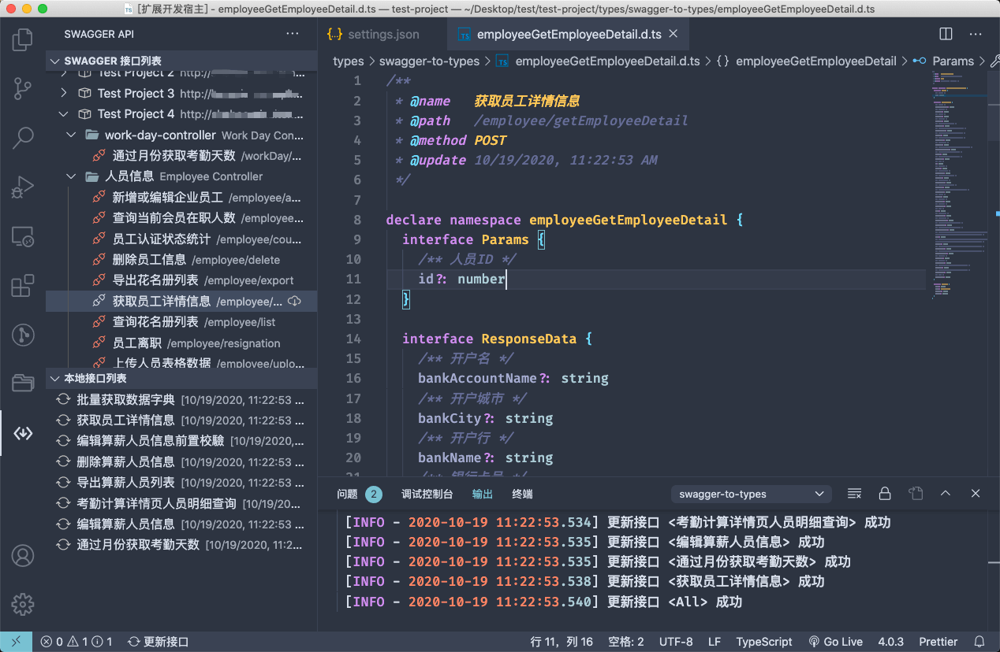

# API Doc to TypeScript Code Generator

一个强大的 VS Code 扩展，支持将多种 API 文档格式自动转换为 TypeScript 类型定义和请求代码。

## ✨ 特性

- 🚀 **多格式支持**: 支持 Swagger v2、OpenAPI 3.0+、Postman Collection 等主流 API 文档格式
- 📝 **智能类型生成**: 自动生成完整的 TypeScript 接口定义，包含请求参数和响应类型
- 🎯 **命名空间隔离**: 每个接口生成独立的命名空间，避免类型冲突
- 🔄 **增量更新**: 智能比对变更，仅更新有变化的接口文件
- 🎨 **自定义模板**: 支持自定义代码生成模板，满足不同项目需求
- ⚡ **快速搜索**: 内置接口搜索功能，快速定位目标 API
- 📋 **一键复制**: 支持生成并复制完整的请求函数代码
- 🌐 **多数据源**: 支持本地文件、远程 URL、多个项目同时管理

## 📸 预览



## 🚀 快速开始

### 1. 安装扩展

在 VS Code 扩展市场搜索 "API Doc to TypeScript" 并安装。

### 2. 配置数据源

在 VS Code 设置中配置你的 API 文档源：

```json
{
  "apiDocToTypes.dataSources": [
    {
      "title": "用户服务 API",
      "url": "https://api.example.com/swagger.json",
      "type": "swagger",
      "link": "https://api.example.com/docs"
    },
    {
      "title": "订单服务 API",
      "url": "./docs/order-api.json",
      "type": "openapi",
      "basePath": "/api/v1"
    }
  ]
}
```

### 3. 生成类型文件

- 使用快捷键 `Alt + Shift + F` 打开接口列表
- 选择需要的接口并生成 TypeScript 类型文件
- 生成的文件将保存到配置的目录中

## ⚙️ 配置选项

| 配置项 | 说明 | 类型 | 默认值 |
| --- | --- | --- | --- |
| `apiDocToTypes.dataSources` | API 文档数据源列表 | [DataSourceItem](#datasourceitem)[] | [] |
| `apiDocToTypes.savePath` | TypeScript 文件保存路径 | string | 'types/api-interfaces' |
| `apiDocToTypes.showStatusbarItem` | 显示状态栏快捷按钮 | boolean | true |
| `apiDocToTypes.compareChanges` | 启用增量更新（仅更新有变化的文件） | boolean | true |
| `apiDocToTypes.reloadWhenSettingsChanged` | 设置变更时自动重新加载 | boolean | true |
| `apiDocToTypes.generateRequestCode` | 自动生成请求函数代码 | boolean | false |
| `apiDocToTypes.typePrefix` | 类型名称前缀 | string | '' |
| `apiDocToTypes.excludePaths` | 排除的接口路径（支持正则） | string[] | [] |

### DataSourceItem

| 属性 | 说明 | 类型 | 必填 | 示例 |
| --- | --- | --- | --- | --- |
| title | 数据源标题 | string | ✓ | "用户服务 API" |
| url | 文档 URL 或本地路径 | string | ✓ | "https://api.example.com/swagger.json" |
| type | 文档类型 | 'swagger' \| 'openapi' \| 'postman' | ✓ | "swagger" |
| link | 在线文档链接 | string |  | "https://api.example.com/docs" |
| basePath | API 基础路径 | string |  | "/api/v1" |
| headers | 请求头配置 | Record<string, string> |  | {"Authorization": "Bearer token"} |
| timeout | 请求超时时间（毫秒） | number |  | 10000 |

## 🎯 支持的文档格式

### Swagger / OpenAPI
- ✅ Swagger 2.0
- ✅ OpenAPI 3.0.x
- ✅ OpenAPI 3.1.x
- ✅ 支持 JSON 和 YAML 格式
- ✅ 支持复杂的数据类型和嵌套对象
- ✅ 支持枚举类型和联合类型

### Postman Collection
- ✅ Postman Collection v2.1
- ✅ 自动解析请求参数和响应示例
- ✅ 支持环境变量替换

### 其他格式
- 🔄 GraphQL Schema（开发中）
- 🔄 RAML（计划中）
- 🔄 API Blueprint（计划中）

## 🎨 自定义模板

### 基础模板配置

创建 `.vscode/swagger-doc-to-code.template.js` 文件来自定义生成的代码格式：

```js
/**
 * 自定义命名空间名称
 * @param {Object} context - 上下文信息
 * @returns {string} 命名空间名称
 */
function namespace(context) {
  const { groupName, pathName, method } = context
  return `${groupName.replace(/[\-\n\s\/\\]/g, '_')}_${pathName}_${method}`
}

/**
 * 自定义参数接口
 * @param {Object} context - 接口上下文
 * @returns {string} 参数接口代码
 */
function params(context) {
  return `export interface Params {
${context.properties.map(prop => `  ${prop.name}${prop.required ? '' : '?'}: ${prop.type}`).join('\n')}
}`
}

/**
 * 自定义响应接口
 * @param {Object} context - 接口上下文
 * @returns {string} 响应接口代码
 */
function response(context) {
  return `export interface Response {
${context.properties.map(prop => `  ${prop.name}${prop.required ? '' : '?'}: ${prop.type}`).join('\n')}
}`
}

module.exports = {
  namespace,
  params,
  response
}
```

### 高级模板示例

#### 1. 添加分组前缀

编辑 `.vscode/swagger-doc-to-code.template.js` 文件：

```js
function namespace(params) {
  return `${params.groupName.replace(/[\-\n\s\/\\]/g, '_')}_${params.pathName}`
}

module.exports = { namespace }
```

#### 2. 将字段名转化为大驼峰

编辑 `.vscode/swagger-doc-to-code.template.js` 文件：

```js
/**
 * 首字母大写
 * @param {String} str
 */
function toUp(str) {
  if (typeof str !== 'string') return ''
  return str.slice(0, 1).toUpperCase() + str.slice(1)
}

function paramsItem(item, params) {
  // 项目标题(swaggerToTypes.swaggerJsonUrl[number].title) 为 demo-1 时忽略定制方案
  if (params.groupName === 'demo-1') return

  return `${toUp(item.name)}${item.required ? ':' : '?:'} ${item.type}`
}

module.exports = { paramsItem }
```

#### 3. 复制请求函数

配置一个请求函数模板用于快速复制。编辑 `.vscode/swagger-doc-to-code.template.js` 文件：

如果导出了 `copyRequest` 函数，即可使用此功能。相关按钮将出现在这几个位置：
- 本地接口列表操作按钮
- `.d.ts` 文件标题栏操作按钮
- `.d.ts` 文件代码行首文字按钮

下面是一个例子：

```js
/**
 * 请求函数模板
 *
 * @param {{
 *  fileName: string
 *  ext: string
 *  filePath: string
 *  name?: string
 *  namespace?: string
 *  path?: string
 *  method?: string
 *  update?: string
 *  ignore?: boolean
 *  savePath?: string
 * }} fileInfo
 * @returns
 */
function copyRequest(fileInfo) {
  return [
    `/** ${fileInfo.name} */`,
    `export async function unnamed(params?: ${fileInfo.namespace}.Params, options?: RequestOptions) {`,
    `  return $api`,
    `    .request<${fileInfo.namespace}.Response>('${fileInfo.path}', params, {`,
    `      method: ${fileInfo.method},`,
    `      ...options,`,
    `    })`,
    `    .then((res) => res.content || {})`
    `}`,
  ]
}

module.exports = {
  // ...
  copyRequest,
}
```

#### 4. 添加 JSDoc 注释

```js
function namespace(context) {
  return [
    `/**`,
    ` * ${context.summary || context.pathName}`,
    ` * @description ${context.description || ''}`,
    ` * @method ${context.method.toUpperCase()}`,
    ` * @path ${context.path}`,
    ` */`,
    `export namespace ${context.pathName} {`
  ].join('\n')
}
```

#### 5. 生成请求函数

```js
function requestFunction(context) {
  const { namespace, path, method, summary } = context
  
  return [
    `/**`,
    ` * ${summary}`,
    ` */`,
    `export async function ${namespace.toLowerCase()}(`,
    `  params?: ${namespace}.Params,`,
    `  options?: RequestOptions`,
    `) {`,
    `  return request<${namespace}.Response>({`,
    `    url: '${path}',`,
    `    method: '${method.toUpperCase()}',`,
    `    ${method.toLowerCase() === 'get' ? 'params' : 'data'}: params,`,
    `    ...options`,
    `  })`,
    `}`
  ].join('\n')
}
```

#### 6. 类型转换优化

```js
function typeMapping(swaggerType, format) {
  const typeMap = {
    'integer': 'number',
    'number': 'number',
    'string': format === 'date-time' ? 'Date' : 'string',
    'boolean': 'boolean',
    'array': 'Array',
    'object': 'Record<string, any>'
  }
  
  return typeMap[swaggerType] || 'any'
}
```

## 🔧 高级功能

### 忽略特定接口

在生成的 `.d.ts` 文件头部添加 `@ignore` 标记，可在批量更新时跳过该文件：

```typescript
/**
 * @name 用户登录接口
 * @path /api/auth/login
 * @method POST
 * @update 2024/01/15 10:30:00
 * @ignore
 */
export namespace UserLogin {
  // ...
}
```

### 批量操作

- **批量生成**: 选择多个接口一次性生成所有类型文件
- **批量更新**: 检查所有已生成的文件并更新有变化的接口
- **批量删除**: 清理不再存在的接口对应的类型文件

### 代码片段集成

扩展提供了丰富的代码片段，在 TypeScript 文件中输入以下前缀：

- `api-get`: 生成 GET 请求函数
- `api-post`: 生成 POST 请求函数
- `api-put`: 生成 PUT 请求函数
- `api-delete`: 生成 DELETE 请求函数
- `api-interface`: 生成接口类型定义

## 🎮 快捷键

| 快捷键 | 功能 |
| --- | --- |
| `Alt + Shift + F` | 打开接口搜索面板 |
| `Alt + Shift + G` | 生成当前文件对应的请求函数 |
| `Alt + Shift + U` | 批量更新所有接口类型 |
| `Alt + Shift + R` | 刷新数据源 |

## 🔌 集成示例

### 与 Axios 集成

```typescript
import axios, { AxiosRequestConfig } from 'axios'
import { UserLogin } from './types/api-interfaces/user-login'

interface RequestOptions extends AxiosRequestConfig {}

export async function login(
  params: UserLogin.Params,
  options?: RequestOptions
): Promise<UserLogin.Response> {
  const response = await axios.post('/api/auth/login', params, options)
  return response.data
}
```

### 与 Fetch 集成

```typescript
import { UserLogin } from './types/api-interfaces/user-login'

export async function login(
  params: UserLogin.Params
): Promise<UserLogin.Response> {
  const response = await fetch('/api/auth/login', {
    method: 'POST',
    headers: {
      'Content-Type': 'application/json'
    },
    body: JSON.stringify(params)
  })
  
  if (!response.ok) {
    throw new Error(`HTTP error! status: ${response.status}`)
  }
  
  return response.json()
}
```

### 与 SWR 集成

```typescript
import useSWR from 'swr'
import { UserProfile } from './types/api-interfaces/user-profile'

export function useUserProfile(userId: string) {
  return useSWR<UserProfile.Response>(
    `/api/users/${userId}`,
    (url) => fetch(url).then(res => res.json())
  )
}
```

## 📝 注意事项

- 支持 Swagger v2 API
- 支持 OpenAPI 3.0.0
- 请不要对模板处理函数的参数直接进行赋值操作，这可能产生破坏性影响
- 模板文件名为 `swagger-doc-to-code.template.js`

## 🛠️ 开发指南

### 本地开发

1. 克隆仓库
```bash
git clone https://github.com/your-repo/api-doc-to-typescript.git
cd api-doc-to-typescript
```

2. 安装依赖
```bash
npm install
```

3. 启动开发模式
```bash
npm run dev
```

4. 在 VS Code 中按 `F5` 启动调试

### 打包和发布

#### 手动打包

```bash
# 基础打包
npm run package

# 自动编译并打包到 dist 目录
npm run package:auto
```

#### 发布到市场

```bash
# 手动发布
npm run publish

# 自动编译并发布
npm run publish:auto
```

#### 打包命令说明

- `npm run package`: 使用 vsce 打包扩展为 .vsix 文件
- `npm run package:auto`: 自动编译 TypeScript 代码并打包到 dist 目录
- `npm run publish`: 发布扩展到 VS Code 市场
- `npm run publish:auto`: 自动编译并发布扩展

**注意**: 发布前请确保已配置 vsce 认证令牌，并更新版本号。

### 贡献代码

我们欢迎社区贡献！请查看 [CONTRIBUTING.md](./CONTRIBUTING.md) 了解详细的贡献指南。

### 插件架构

```
src/
├── core/                 # 核心解析引擎
│   ├── parsers/         # 各种文档格式解析器
│   ├── generators/      # 代码生成器
│   └── templates/       # 模板引擎
├── commands/            # VS Code 命令
├── views/              # 用户界面
├── tools/              # 工具函数
└── types/              # 类型定义
```

## 🐛 故障排除

### 常见问题

**Q: 生成的类型不正确？**
A: 检查 API 文档格式是否符合规范，确保 JSON Schema 定义完整。

**Q: 无法访问远程 API 文档？**
A: 检查网络连接和认证配置，确保 URL 可访问。

**Q: 生成的文件被覆盖？**
A: 在文件头部添加 `@ignore` 标记，或关闭自动更新功能。

**Q: 类型名称冲突？**
A: 使用自定义模板修改命名规则，或配置类型前缀。

### 调试模式

启用调试模式查看详细日志：

```json
{
  "apiDocToTypes.debug": true,
  "apiDocToTypes.logLevel": "verbose"
}
```

## 📄 许可证

MIT License - 查看 [LICENSE](./LICENSE) 文件了解详情。

## 🤝 社区

- [GitHub Issues](https://github.com/your-repo/api-doc-to-typescript/issues) - 报告问题和功能请求
- [GitHub Discussions](https://github.com/your-repo/api-doc-to-typescript/discussions) - 社区讨论
- [VS Code Marketplace](https://marketplace.visualstudio.com/items?itemName=your-publisher.api-doc-to-typescript) - 扩展页面

## 🙏 致谢

感谢所有贡献者和社区成员的支持！

---

**享受编码！** 🚀
